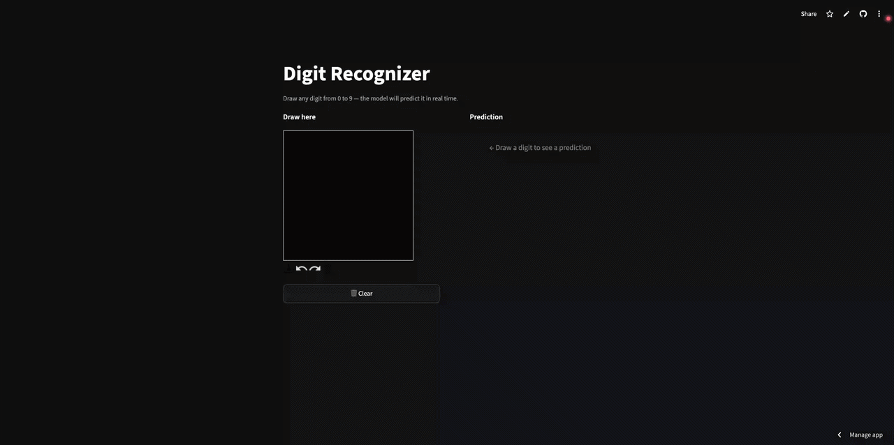

# MNIST Digit Recognizer

[](https://mnist-digit-recognizer-zohaib2001.streamlit.app/)
[](https://www.python.org/)
[](https://pytorch.org/)
[](https://streamlit.io/)
[](#-results)


I built this interactive web application to bridge the gap between machine learning models and user interaction. While training models on the classic MNIST dataset is a staple of machine learning education, it's rare to see them working live on the web. This tool allows anyone to test a Deep Learning model's real-time computer vision capabilities by simply drawing a digit directly on their browser canvas.

---

## 「 ✦ Preview ✦ 」

| Live Demo |
| :---: |
| [](https://mnist-digit-recognizer-zohaib2001.streamlit.app/) |
|  |

---

## ⋆˙⟡ Features

* **Live Prediction:** Draw any digit (0–9) on the canvas and the model predicts it instantly, no submit button needed.
* **Confidence Breakdown:** A bar chart shows the model's probability score for all 10 digits, not just the winner.
* **Smart Channel Filtering:** The app isolates the visual color channels to bypass deceptive frontend alpha transparency layers, executing predictions only when a deliberate stroke is detected.
* **Session-State Reset:** The Clear button increments a Streamlit session state key, forcing the canvas component to completely remount and discard ghost artifacts cleanly.
* **Custom UI Styling:** Tailored internal CSS overrides default behaviors to ensure text labels, the prominent prediction display, and the probability chart maintain sharp contrast across both light and dark browser themes.
* **Cached Model Loading:** The model loads once on startup and stays in memory, no lag between predictions.

---

## 𐔌՞. .՞𐦯 How It Works

```
Your drawing  →  Isolate RGB channels  →  Convert to Grayscale ('L')  →  Resize to 28×28px (Lanczos)  →  Normalize  →  Neural network  →  Prediction
```

The model is a feedforward neural network, no convolutions, just stacked linear layers learning to recognize patterns in pixel values.

```
Input      784 neurons   (28×28 image, flattened into a list)
                ↓
Layer 1    256 neurons   Linear → ReLU → Dropout(0.2)
                ↓
Layer 2    128 neurons   Linear → ReLU
                ↓
Output      10 neurons   one score per digit (0–9)
```

| Component | Role |
| :--- | :--- |
| `nn.Flatten` | Unrolls the 28×28 pixel grid into 784 numbers |
| `nn.Linear` | Learnable weights that detect patterns across pixels |
| `nn.ReLU` | Activation function - lets the network learn non-linear shapes |
| `nn.Dropout(0.2)` | Randomly silences 20% of neurons during training to prevent memorization |
| `CrossEntropyLoss` | Measures how wrong each prediction is |
| `Adam` optimizer | Updates all weights after every batch of 64 images |

**The training loop in plain English:**

```
For each batch of 64 images (repeated 5× over 60,000 images):
  1. Forward pass   → model makes a prediction
  2. Compute loss   → measure how wrong it was
  3. Backward pass  → trace which weights caused the error (backpropagation)
  4. Update weights → nudge every weight slightly toward being more correct
```

---

## ᯓ➤ Getting Started

**1. Clone the repo**
```bash
git clone https://github.com/zohaib2001/mnist-digit-recognizer.git
cd mnist-digit-recognizer
```

**2. Create a virtual environment**
```bash
python -m venv venv

# macOS / Linux
source venv/bin/activate

# Windows
venv\Scripts\activate
```

**3. Install dependencies**
```bash
pip install -r requirements.txt
```

**4. Launch the app** The pre-trained model weights (`model.pth`) are tracked right inside the repository out of the box, meaning you can launch the interactive interface immediately:
```bash
streamlit run app.py
```

---

## ⿻ File Structure

```
mnist-digit-recognizer/
│
├── train.ipynb        # Training notebook
├── app.py             # Streamlit app: draw a digit, get a prediction
├── model.pth          # Pre-trained model weights (included)
│
├── requirements.txt   # All dependencies
├── .gitignore         
└── README.md
```

---

## ▀▄▀▄▀▄ Results

| Parameter | Value |
| :--- | :--- |
| Training images | 60,000 |
| Test images | 10,000 |
| Epochs | 5 |
| Batch size | 64 |
| Optimizer | Adam - lr 0.001 |
| Final training loss | 0.0842 |
| **Test accuracy** | **97.90%** |

The model correctly identified **9,790 out of 10,000** handwritten digits it had never seen during training.

---

## ˗ˏˋ ★ ˎˊ˗ What I Learned

* **Data pipelines** : loading, transforming, and batching images with `DataLoader`
* **Neural network anatomy** : what layers, activations, and dropout actually do
* **The training loop** : forward pass, loss, backpropagation, and weight updates end-to-end
* **Evaluation** : why train/test splits exist and how to avoid data leakage
* **Deployment** : turning a saved model into a live interactive app with Streamlit
* **Debugging ML apps** : tracking down a blank-canvas false-positive caused by background pixel values

---
